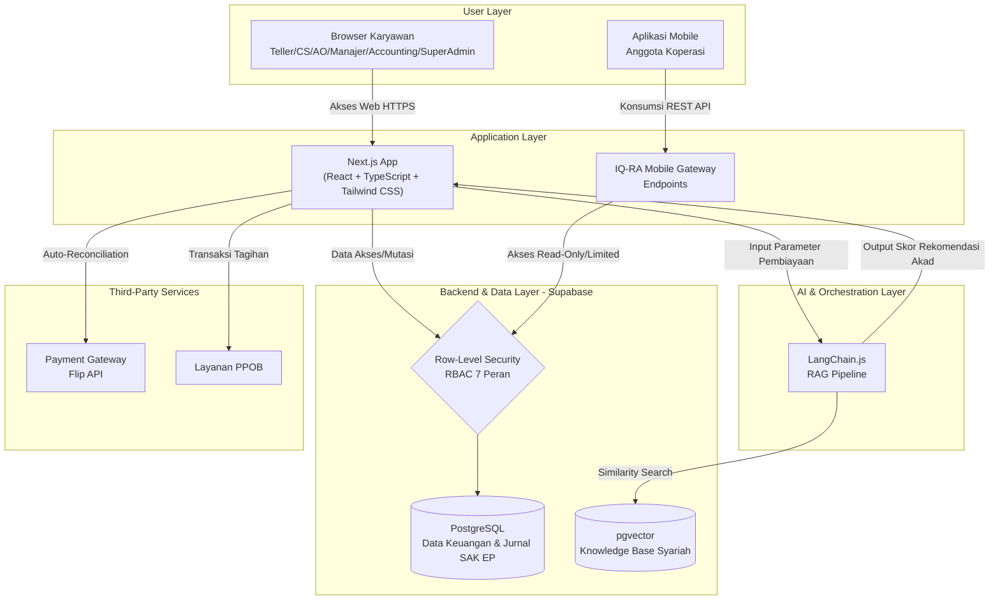

# Arsitektur Sistem: IQ-RA System

Dokumen ini menguraikan arsitektur tingkat tinggi dari IQ-RA System.

**Versi:** 1.4 | **Diperbarui:** 2 Juni 2026

---

## 1. Pendekatan Arsitektur Utama

IQ-RA System mengadopsi arsitektur **Full-stack Serverless**:
- **Skalabilitas & Ketersediaan Tinggi:** Target SLA 99.9% tanpa server fisik.
- **Efisiensi Pemeliharaan:** Reduksi beban manajemen infrastruktur backend.
- **Eksekusi Cepat:** Latensi minimal antara antarmuka, logika server, dan database.

---

## 2. Diagram Arsitektur (High-Level)



---

## 3. Struktur Direktori Aplikasi

```
src/
├── app/
│   ├── page.tsx              ← Homepage publik (LOCKED)
│   ├── login/                ← Halaman login (LOCKED)
│   ├── register/             ← Halaman register (LOCKED)
│   ├── dashboard/            ← Super Admin dashboard
│   ├── teller/               ← Layanan Kasir (6 UI Utama — Aktif)
│   ├── customer-service/     ← Dashboard CS
│   ├── ao/                   ← Dashboard Account Officer
│   ├── accounting/           ← Dashboard Accounting
│   ├── manager/              ← Dashboard Manager
│   ├── dps/                  ← Dashboard DPS
│   ├── members/              ← Portal Anggota
│   └── api/                  ← API Routes (Server-side only)
├── components/
│   ├── brand/BrandLogo.tsx
│   └── dashboard/
│       ├── TellerTerminal.tsx        ← Komponen transaksi teller
│       ├── CSDashboard.tsx
│       ├── AccountingDashboard.tsx
│       ├── GlobalSiteBackground.tsx  ← Background papercut (LOCKED)
│       └── ...
├── lib/
│   ├── supabase/             ← Klien Supabase
│   └── constants/coa.ts      ← Chart of Accounts (COA SAK EP)
└── services/
    └── accounting.service.ts ← Logika double-entry
```

---

## 4. Komponen Teknologi

### 4.1. Frontend Web
- **Framework:** Next.js (App Router), React, TypeScript.
- **Styling:** Tailwind CSS + CSS Variables (`var(--bg-page)`, `var(--gold-bright)`, dll.).
- **Tema:** Light/Dark Mode via `ThemeContext` dan class `.light-mode`.

### 4.2. Backend & Database (Supabase)

| Tabel | Fungsi | Migration |
|---|---|---|
| `users` | Kredensial & RBAC (8 peran) dengan RLS | `20260512000000_initial_schema.sql` |
| `members` | Data CIF anggota (KYC & APU-PPT) | `20260602000100_missing_tables_and_coa_patch.sql` |
| `savings_accounts` | Rekening simpanan (pokok/wajib/wadiah) | `20260520000000_setup_cooperative_savings.sql` |
| `savings_transactions` | Mutasi setoran & penarikan harian | `20260520000000_setup_cooperative_savings.sql` |
| `journal_entries` | Buku besar double-entry SAK EP | `20260512000000_initial_schema.sql` |
| `financing_contracts` | Akad pembiayaan, amortisasi, nisbah, `audit_metadata` (JSONB) | `20260512000000_initial_schema.sql` |
| `prospects` | Pipeline pengajuan calon debitur (AO workflow) | `20260514000300_finalize_financing_workflow.sql` |
| `teller_shifts` | Log buka/tutup shift kasir harian | `20260529000000_setup_teller_shifts.sql` |
| `system_parameters` | Parameter dinamis operasional koperasi | `20260523000000_setup_system_parameters.sql` |
| `sharia_knowledge` | Vector embeddings fatwa DSN-MUI (pgvector, 1536-dim) | `20260514000200_setup_rag_vector_db.sql` |
| `audit_logs` | Log seluruh aksi Super Admin (keamanan & tata kelola) | `20260602000000_superadmin_extensions.sql` |
| `user_activities` | Riwayat aktivitas login & aksi pengguna | `20260602000000_superadmin_extensions.sql` |
| `coa_accounts` | Chart of Accounts SAK EP (202+ akun dinamis) | `20260602000000_superadmin_extensions.sql` |
| `system_tasks` | Tiket penugasan & tugas operasional staf | `20260602000000_superadmin_extensions.sql` |
| `access_rules` | Aturan otorisasi per-role (wewenang & batasan) | `20260602000100_missing_tables_and_coa_patch.sql` |
| `notifications` | Notifikasi sistem untuk pengguna (alert UI) | `20260603000000_add_notifications_table.sql` |

> **Referensi lengkap:** Lihat `supabase/tables_map.json` untuk pemetaan tabel → lokasi kode, dan `supabase/MASTER_PATCH.sql` untuk SQL patch aman yang dapat dijalankan langsung di Supabase Studio.

### 4.3. Modul RAG (AI Engine)
- **LangChain.js:** Orkestrator prompt & pipeline RAG.
- **pgvector:** Similarity search knowledge base syariah (1536-dim).
- **Model Embedding:** `gemini-embedding-001` (Google AI) — dengan auto-retry 429, zero-padding/slicing otomatis.
- **Model LLM:** `gemini-2.5-flash` (cascade fallback ke `gemini-1.5-flash`).
- **Alur Audit DPS:** Kontrak dipilih → `/api/ai/audit-contract` → RAG context → Opini + Compliance Score → DPS checklist.

### 4.4. Chart of Accounts (COA SAK EP)
Defined in `src/lib/constants/coa.ts`:
- `101.01` — Kas di Tangan (CASH_ON_HAND)
- `301.01` — Simpanan Pokok (SAVINGS_WADIAH)
- `401.01` — Piutang Murabahah (RECEIVABLE_MURABAHAH)
- `401.02` — Pendapatan Administrasi (INCOME_SERVICE_FEE)
- `302.01` — Dana Kebajikan / Retained Earnings

---

## 5. Arsitektur UI Teller (6 Panel)

```mermaid
graph LR
    Sidebar -->|[1]| P1[Dasbor Shift]
    Sidebar -->|[2]| P2[Profil Anggota]
    Sidebar -->|[3]| P3[Setoran Tunai]
    Sidebar -->|[4]| P4[Penarikan Tunai]
    Sidebar -->|[5]| P5[Angsuran]
    Sidebar -->|[6]| P6[Buka/Tutup Shift]

    P2 -.->|shared state selectedMember| P3
    P2 -.->|shared state selectedMember| P4
    P2 -.->|shared state selectedMember| P5
```

---

## 6. Keamanan & Deployment Pipeline

- **RLS:** Seluruh tabel dilindungi RLS berdasarkan peran login.
- **ACID Compliance:** Transaksi double-entry tidak boleh separuh-jalan.
- **CI/CD:** GitHub Actions + SonarCloud untuk setiap PR ke `main`/`staging`.
- **Secrets:** `.env.local` masuk `.gitignore`, API keys hanya di server-side.
